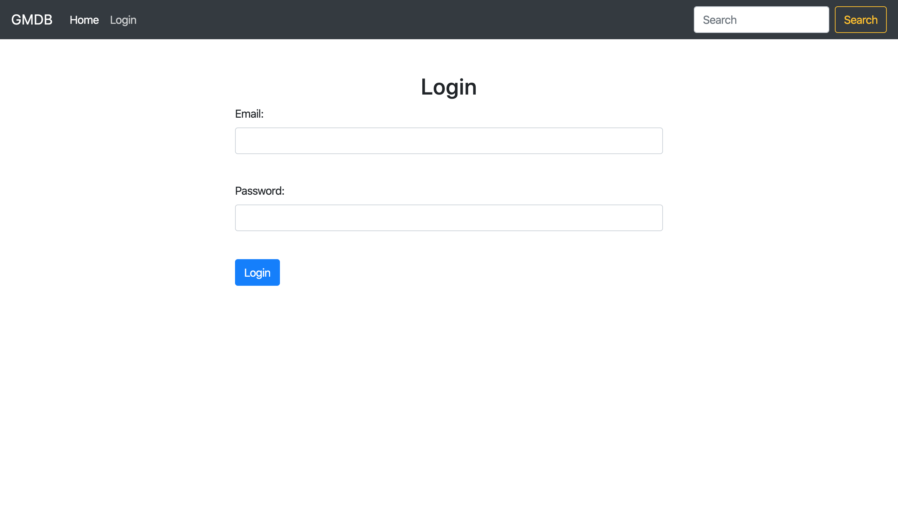

# USSF_HTML_Checkpoint

Done in pair programming with Ray Kell

This project will evaluate your ability to create a website from a high fidelity design.

The goal of this checkpoint is not to get an A. The goal is to show us what you have learned and how much you can get done independently. Like other checkpoints, you are free to use the Internet look things up and look at past Learn content!

The only thing we do not want you to do is look up solution code or copy code from other students. Doing so will hinder our evaluation of your progress and how we will be able to help you moving forward.

Submitting the project:

Create a new repository named USAF-html-checkpoint to submit your code for this project.
Submit a link to your respository below.
Project instructions

Recreate the GMDB webpage (sample images below) from scratch using raw HTML and CSS
The images provided should guide your design
The webpage has, as you'll see a login page (when you first arrive), a top navigation bar, a browse display of multiple movies and if an individual movie is clicked on, its details and a Leave a comment feature are displayed.
Do your best to implement those 4 features using what you have learned about HTML and CSS.
Feel free to use outside resources if you need assistance with syntax for HTML or CSS.
This is a purely visual exercise, do not worry about data/content - feel free to hardcode movie data to make things look operational.

Excercise examples:
----

