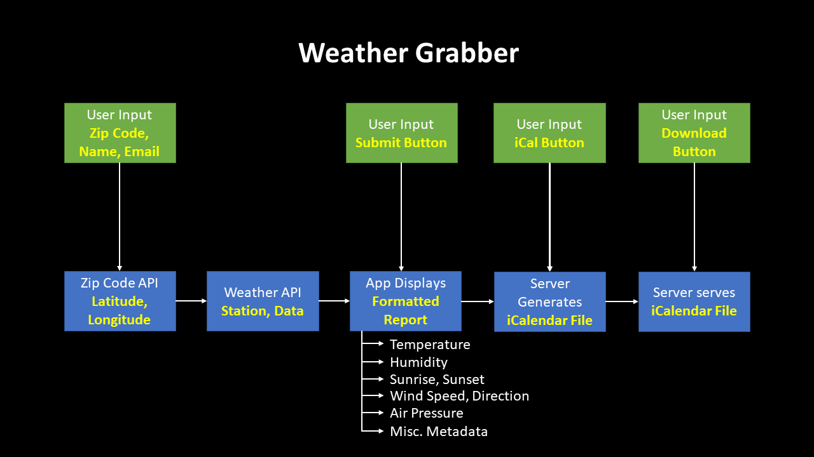

# Weather Grabber

#### The Weather Grabber is a simple web-application that takes user input and provides a daily weather forcast to the user. This application sends data through a location and weather API, and then formats the data into a daily weather report in .ics format. This application then creates a ready-to-send event with the daily weather summary.

## Instructions

#### This application relies on a proxy-server for requests to APIs with strict access control policies and an express server for POST and GET of .ics data for the user. To start the proxy server, express server, and the application concurrently simply do the following:
1. Fork and clone/pull down the entire repository
2. While at the root of the repository, in your command line, execute ```npm install```
    - This will execute ```npm install``` in the root of the directory
    - A post-install will also execute ```mkdir data```, ```npm update --force``` and ```cd ./server/expressServer && npm install```
    - Extra install steps were scipted in order to install and fix broken node modules in the application (known issue in npm@7), and to provide local server storage for .ics files
3. While at the root of the repository, in your command line, execute ```npm start```
    - This will execute ```node ./server/server.js```, ```react-scripts start```, ```node ./server/nodejsapi/expressServer.js``` at the same time
    - The proxy-server (server.js) will run in the background on localhost://8080
    - The express server (expressServer.js) will run in the background on localhost://5001
    - The Weather Grabber application will pop-up in-browser on localhost://(port, e.g. 3000)

#### APIs used:
- [ZipCodeAPI](https://www.zipcodeapi.com/): for transforming user input zip code into latitude and longitude for MetaWeather querying
- [MetaWeather](https://www.metaweather.com/): for getting weather data based on the latitude and longitude of the user

#### Notable packages:
- [cors-anywhere](https://github.com/Rob--W/cors-anywhere): proxy-server which adds CORS headers to all requests
- [ics](https://github.com/adamgibbons/ics): formats inputs into iCalendar (ics)-compliant data
- [create-react-app](https://github.com/facebook/create-react-app): sets-up a react app in one command
- [body-parser](https://github.com/expressjs/body-parser#readme): formats incoming POST request data into parsable data
- [node-fetch](https://github.com/node-fetch/node-fetch): writes files to the express server upon successful POST requests
- [express](https://github.com/expressjs/express): minamalist web framework for node

## Concept of Operations

