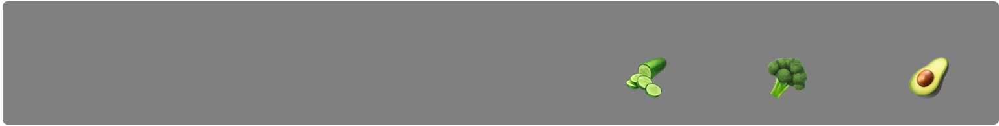

# Flex and Grid
## Steps

1. Check out the provided `index.html` file so you're familiar with what you need to style.

1. Use `index.css` to manipulate `.fruit-box` to correctly display fruit _food-items_
    

1. Use `index.css` to manipulate `.veggie-box` to correctly display veggie _food-items_

    

1. Use `index.css` to manipulate `.beverage-box` to display beverage _food-items_

    

1. Add CSS for `.grid-wrapper` to display all 3 `flex-container`s like the image below:

    
