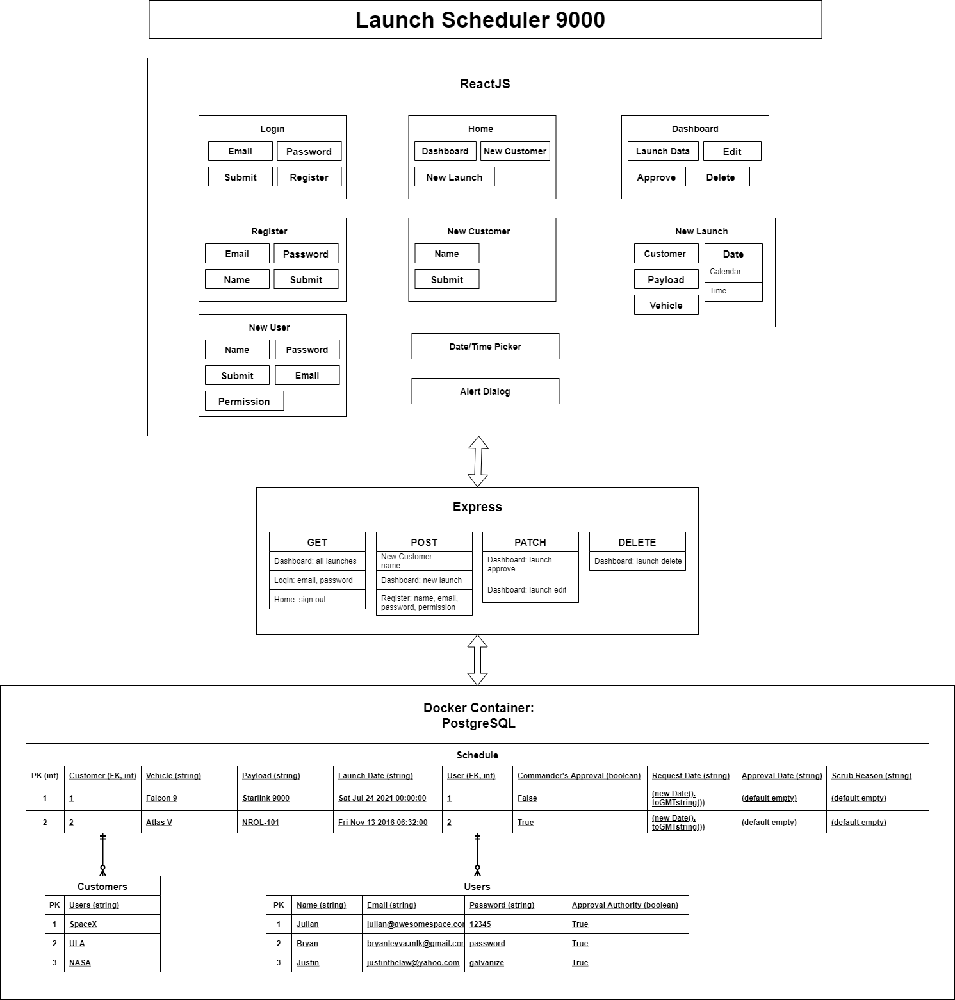

# Launch Scheduler 9000

## Table of Contents
 1. [Overview](#Overview)
 2. [Description](#Description)
 3. [Installation](#Installation)
 4. [Team Members](#Team-Members)
 5. [Roadmap](#Roadmap)
 6. [License](#License)

## Overview
Launch Scheduler 9000 allows registered users to file, view, and approve scheduled launches on a minimalistic dashboard.

## Description


## Installation
  1. Please modify the .env.example file, following the format commented within the .env.example file. Delete the comments and the .example extension of the .env file before running the application.

  2. To run the application, please start your PostgreSQL docker container and CREATE DATABASE as named in your .env file.

  3. Go to the frontend folder and execute ```npm install```

  4. Go to the backend folder and execute ```npm install```

  5. To implement migrations into your database, execute ```npx knex migrate:latest```

  6. To add seed data to your migrations, execute ```npx knex seed:run```

  7. Go to the frontend and execute ```npm start``` to start the React app.

  8. Go to the backend and execute ```npm start``` to start the Express server.

  9. Please use the dummy information below to login to the app for the first time, and then create your own user information:
     - Email: justinthelaw@yahoo.com
     - Password: galvanize

  10. Now you can create launch schedules, register users, and register customers!

## Team Members

 - Bryan Leyva: Project Commander; the fate of the project rests on his shoulders
    - [Bryan's GitHub](https://github.com/bleyva21)
 - Justin Law: Lead software developer; decideds all critical implementations
    - [Justin's GitHub](https://github.com/justinthelaw)
 - Julian Heinze: Founder; came up with the name of the app
    - [Julian's GitHub](https://github.com/nailuj843)

## Roadmap
Future enhancements:
- Only show current launch dates that haven't launched yet and the ability to archive past ones (10 year history of records)
- Do verification of edited data - currently you can submit an edit with no changes which causes CC Approval => false
- Add new permission levels for: new user registration, customer registration, delete users, etc.
- Make launch vehicles a select list based on up-to-date launch vehicle lists from customers
- Register users from the login page and add 'help' contact info
- Log all edits to a launch in a new table and show on dashboard and/or separate window when launch schedule row is clicked
- Current state of project is 'useable', however it is limited and has not been deployed
- App is only being maintained for this week 7/9/2021, until viability can be confirmed

## License
This software is licensed under the [MIT](./LICENSE) license.